# casual-chess (without clock)

There are already other great places to play chess on the internet, but they are also complex and loaded with features. Sometimes you just want to play a game with someone you know without having to register anywhere. Casual Chess tries to fill that gap.

Casual Chess is an [ionic](https://ionicframework.com/) and [firebase](https://firebase.google.com/) application. It is written
in [TypeScript](http://www.typescriptlang.org/) and [Angular](https://angular.io/).

It is distributed as a PWA: [https://casual-chess.web.app](https://casual-chess.web.app/)

## Home screen

From the home screen you can create a new game or access your list of games:

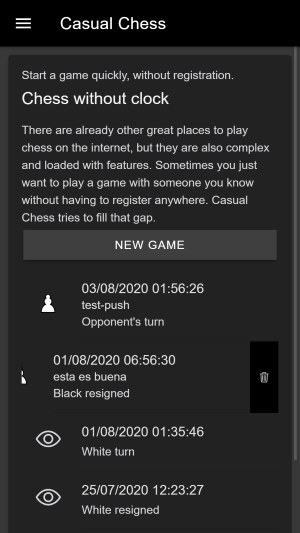

You can slide a game to the left to access the button that allows you to delete it.

## New game

When creating a new game, you first have to select which pieces you want to use:

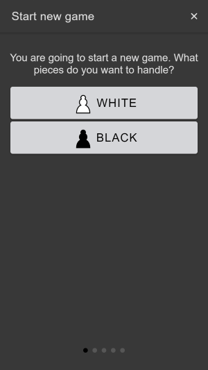

Next you assign a name to the game, to be able to locate it in the list of the home easily:

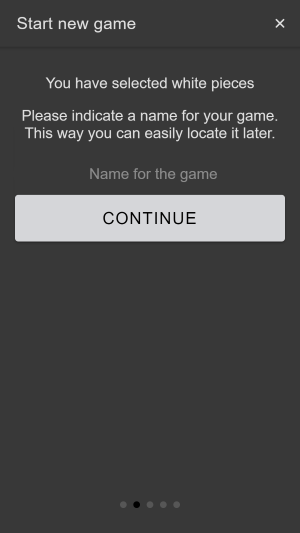

When creating the game 3 unique links are generated. One for the player with the white pieces, one for the player with the black pieces and one for spectators. The following screens allow you to copy these links to the clipboard or share them via whatsapp, telegram or email.
Each player has to use their link and keep it a secret ... anyone with the link could move your pieces instead!

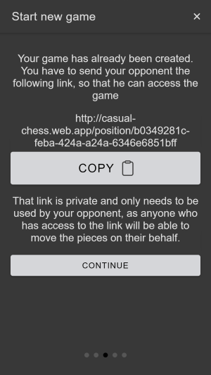

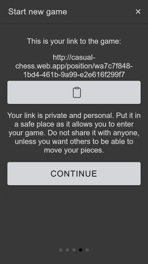

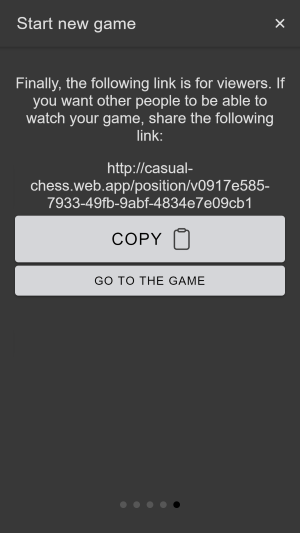

## The game

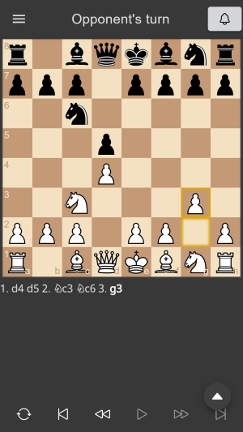

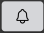
As players make moves, a push notification is sent to the opponent. With the top right bell you can disable and re-enable notifications for this game.

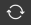
If you play with white pieces, these appear below and the black pieces above. If you play with black pieces, they appear below and the white ones above. However, at any time you can flip the board with the first button on the bottom toolbar.

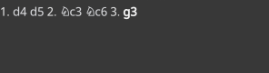

You can navigate to any position in the game by clicking on the movement in the area where they are written, or by navigating with the bottom toolbar.

The floating button shows and hides other options:

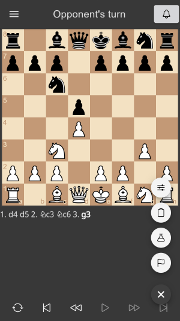

Settings button: show the configuration screen. You can also access the settings from the menu, but from the menu you exit the game and you have to enter again. From the floating button, you stay in the game:

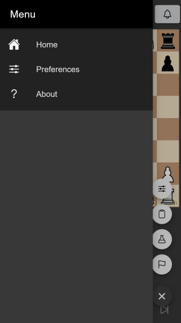

Clipboard button: show de clipboard dialog:

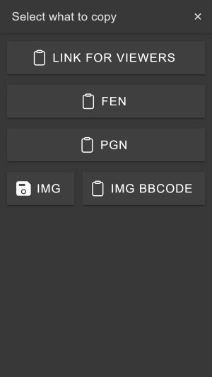

From this screen you can copy to the clipboard: the link for spectators, the FEN of the current position, the PGN of the game or save a screenshot of the board. You can also generate a bbcode for the screenshot to share it in forums.

Analysis button: displays an analysis board to explore variants from the current position. The analysis can be saved, and if you already have previous analyses for this game, you will be shown a dialog that allows you to continue with any previous analysis or start a new one.

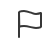

Abandon / Offer draw / Undo move: displays a dialog box that allows you to leave the game or offer tables (if it is your turn) or request undo your latest move (if it is not your turn):

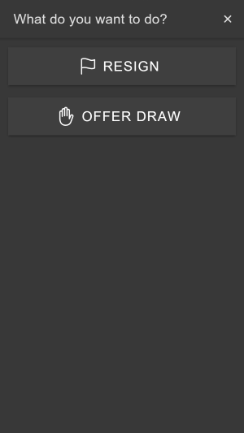

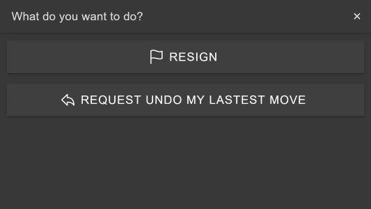

## The analysis board

This screen allows you to explore different variants, with any depth level:

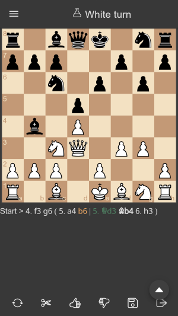

You can navigate directly to any movement by clicking on it in the notation area.
You can mark movements as "good" or "bad" with the thumb-up and thumb-down buttons.
Scissors allow you to prune a variant.
The floppy disk allows you to save the analysis, in case you want to continue later or share it with someone.
On this screen, the "copy to clipboard" dialog box shows one more option that allows you to share a link to the analysis:

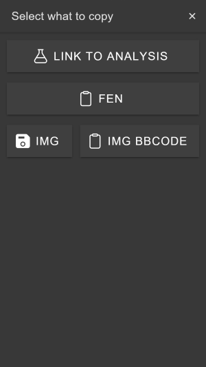

## Preferences

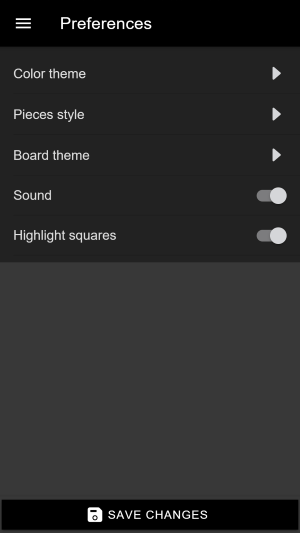

Here you can change the aesthetics of the application (light / dark theme, style of the pieces, colors of the board, lighting of squares) and if you want it in silent mode or to make sound when moving pieces.

## Credits

Following software and resources has been used:

* [chess.js](https://github.com/jhlywa/chess.js): A Javascript chess library for chess move generation/validation, piece placement/movement, and check/checkmate/draw detection
* [chessground](https://github.com/ornicar/chessground): A chess board for mobile and web apps
* Free Icons by Smashicons from Flaticon, Inipagi from Iconfinder and Cburnett from Wikimedia Commons 
* [Lichess 'figurine' font](https://github.com/ornicar/lila)
* Chess piece sets: alpha (Eric Bentzen), [california (Jerry S)](https://sites.google.com/view/jerrychess/home), [cburnett (Colin M.L. Burnett)](https://commons.wikimedia.org/wiki/Category:SVG_chess_pieces#/media/File:Chess_Pieces_Sprite.svg), [chess7 (Alexander Sizenko)](http://www.styleseven.com/php/get_product.php?product=Chess-7%20font), [chessnut (Alexis Luengas)](https://github.com/LexLuengas/chessnut-pieces), [chicago (Benjamin Friedrich)](https://github.com/benjfriedrich/chess-foundry-pack), companion (David L. Brown), [fantasy (Maurizio Monge)](https://commons.wikimedia.org/wiki/Category:SVG_chess_pieces/Maurizio_Monge), [iowa (Benjamin Friedrich)](https://github.com/benjfriedrich/chess-foundry-pack), [kosal (philatype)](https://github.com/philatype/kosal), leipzig (Armando Hernández Marroquin), letter (???), merida (Armando Hernández Marroquin), mono (???), [oslo (Benjamin Friedrich)](https://github.com/benjfriedrich/chess-foundry-pack), [pirouetti](https://lichess.org/@/pirouetti), [pixel (therealqtpi)](https://twitter.com/therealqtpi), [reilly (Reilly Craig)](http://reillycraig.ca), riohacha (???), [shapes (Jimmie Elvenmark)](https://github.com/flugsio/chess_shapes), [spatial (Maurizio Monge)](https://commons.wikimedia.org/wiki/Category:SVG_chess_pieces/Maurizio_Monge), [symmetric (Arcticpenguins)](https://www.dropbox.com/sh/jws5b0hgf71udsf/AAAZCxF4PQ02nkhwPZN3qHxia?dl=0)
