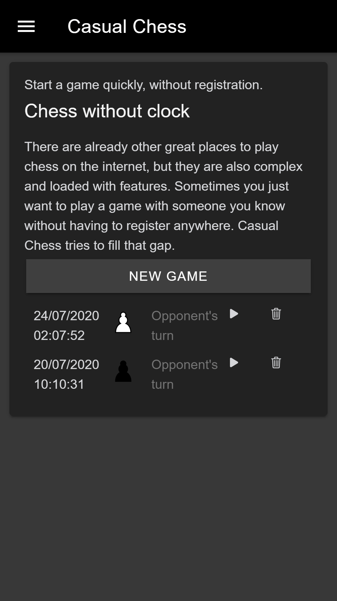
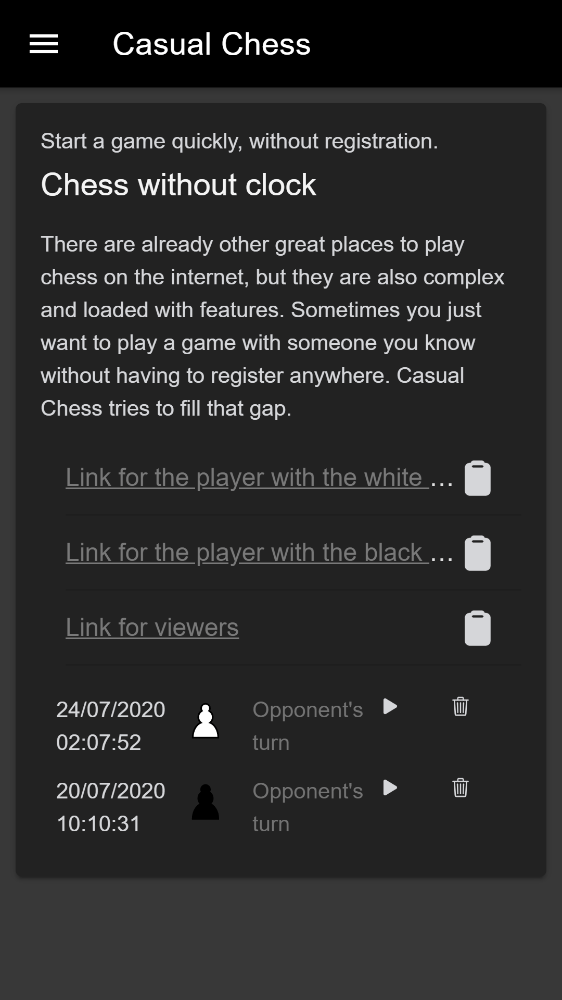
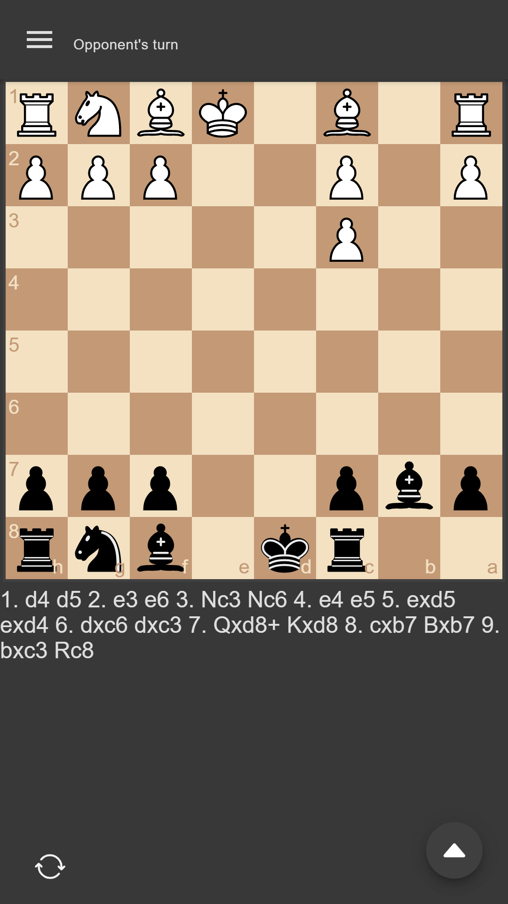
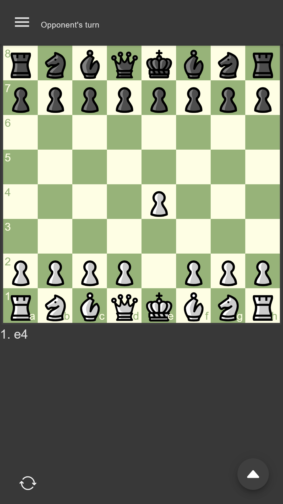
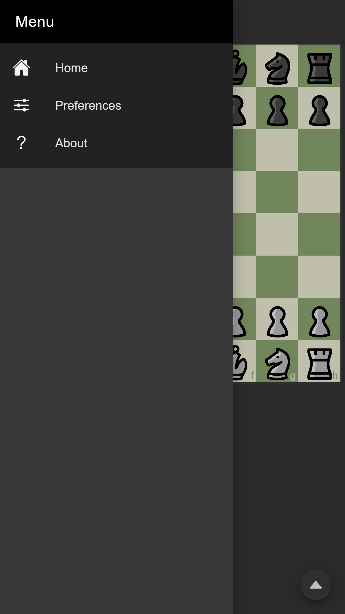
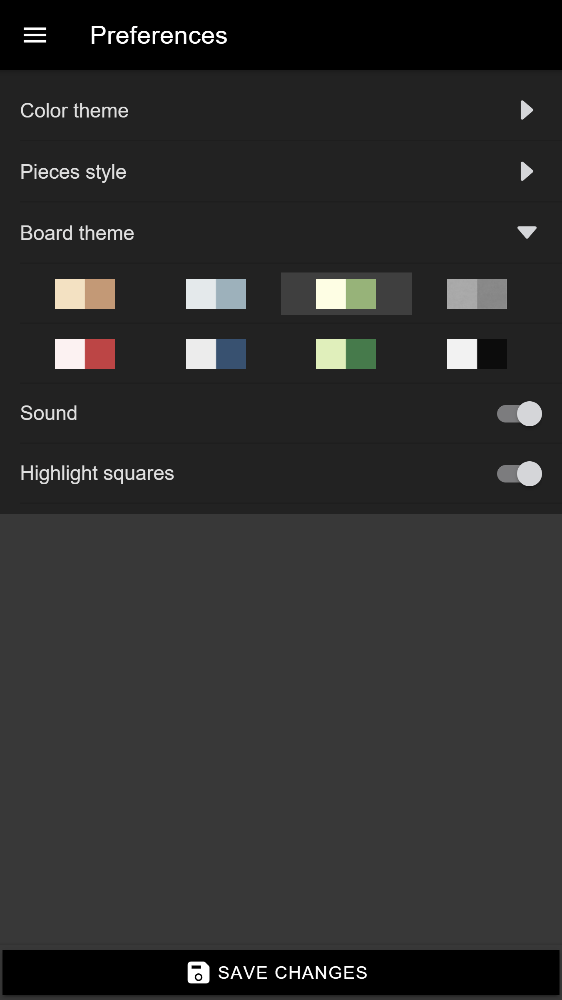
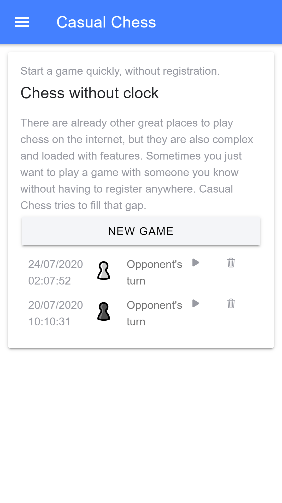

# casual-chess (without clock)

There are already other great places to play chess on the internet, but they are also complex and loaded with features. Sometimes you just want to play a game with someone you know without having to register anywhere. Casual Chess tries to fill that gap.

Casual Chess is an [ionic](https://ionicframework.com/) and [firebase](https://firebase.google.com/) application. It is written
in [TypeScript](http://www.typescriptlang.org/) and [Angular](https://angular.io/).

It is distributed as a [web app](https://casual-chess.web.app/)

## Screenshots

Following software and resources has been used:

* [chess.js](https://github.com/jhlywa/chess.js): A Javascript chess library for chess move generation/validation, piece placement/movement, and check/checkmate/draw detection
* [chessboard.js](http://chessboardjs.com): A Javascript chess board
* Free Icons by Smashicons from Flaticon, Inipagi from Iconfinder and Cburnett from Wikimedia Commons 
* Chess piece sets: alpha (Eric Bentzen), [california (Jerry S)](https://sites.google.com/view/jerrychess/home), [cburnett (Colin M.L. Burnett)](https://commons.wikimedia.org/wiki/Category:SVG_chess_pieces#/media/File:Chess_Pieces_Sprite.svg), [chess7 (Alexander Sizenko)](http://www.styleseven.com/php/get_product.php?product=Chess-7%20font), [chessnut (Alexis Luengas)](https://github.com/LexLuengas/chessnut-pieces), [chicago (Benjamin Friedrich)](https://github.com/benjfriedrich/chess-foundry-pack), companion (David L. Brown), [fantasy (Maurizio Monge)](https://commons.wikimedia.org/wiki/Category:SVG_chess_pieces/Maurizio_Monge), [iowa (Benjamin Friedrich)](https://github.com/benjfriedrich/chess-foundry-pack), [kosal (philatype)](https://github.com/philatype/kosal), leipzig (Armando Hernández Marroquin), letter (???), merida (Armando Hernández Marroquin), mono (???), [oslo (Benjamin Friedrich)](https://github.com/benjfriedrich/chess-foundry-pack), [pirouetti](https://lichess.org/@/pirouetti), [pixel (therealqtpi)](https://twitter.com/therealqtpi), [reilly (Reilly Craig)](http://reillycraig.ca), riohacha (???), [shapes (Jimmie Elvenmark)](https://github.com/flugsio/chess_shapes), [spatial (Maurizio Monge)](https://commons.wikimedia.org/wiki/Category:SVG_chess_pieces/Maurizio_Monge), [symmetric (Arcticpenguins)](https://www.dropbox.com/sh/jws5b0hgf71udsf/AAAZCxF4PQ02nkhwPZN3qHxia?dl=0)
